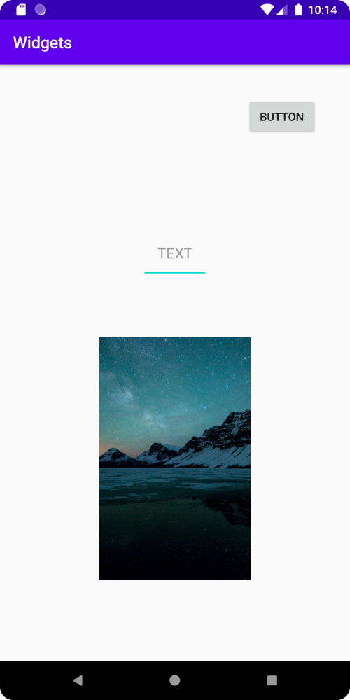

# Rapport

Tre olika widgets lades till i appen.
Detta gjordes genom att lägga till kod i "activity_main.xml" filen.

En ConstraintLayout används, som innehåller 3 olika widgets.
Dessa 3 widgets är en "Button", en "ImageView", och en "EditText".

Dessa widgets har även olika constraints, vilket gör att de placeras på olika ställen i appen.
ImageView widgeten har även en satt bredd och längd på 300dp, 
medan de andra helt enkelt är tillräckligt stora för att fylla sitt innehåll.

Koden ser ut som följande:

```
<androidx.constraintlayout.widget.ConstraintLayout xmlns:android="http://schemas.android.com/apk/res/android"
    xmlns:app="http://schemas.android.com/apk/res-auto"
    xmlns:tools="http://schemas.android.com/tools"
    android:layout_width="match_parent"
    android:layout_height="match_parent"
    tools:context=".MainActivity">

    <Button
        android:id="@+id/button2"
        android:layout_width="wrap_content"
        android:layout_height="wrap_content"
        android:layout_marginTop="40dp"
        android:layout_marginEnd="40dp"
        android:layout_marginRight="40dp"
        android:text="Button"
        app:layout_constraintEnd_toEndOf="parent"
        app:layout_constraintTop_toTopOf="parent" />

    <ImageView
        android:id="@+id/imageView"
        android:layout_width="300dp"
        android:layout_height="300dp"
        android:layout_marginBottom="100dp"
        android:src="@drawable/portrait_background"
        app:layout_constraintBottom_toBottomOf="parent"
        app:layout_constraintEnd_toEndOf="parent"
        app:layout_constraintStart_toStartOf="parent" />

    <EditText
        android:id="@+id/editText"
        android:layout_width="wrap_content"
        android:layout_height="wrap_content"
        android:layout_marginTop="200dp"
        android:hint="TEXT"
        android:inputType="text"
        android:padding="20dp"
        app:layout_constraintEnd_toEndOf="parent"
        app:layout_constraintStart_toStartOf="parent"
        app:layout_constraintTop_toTopOf="parent" />
</androidx.constraintlayout.widget.ConstraintLayout>
```

Resultatet ser ut som följande:

